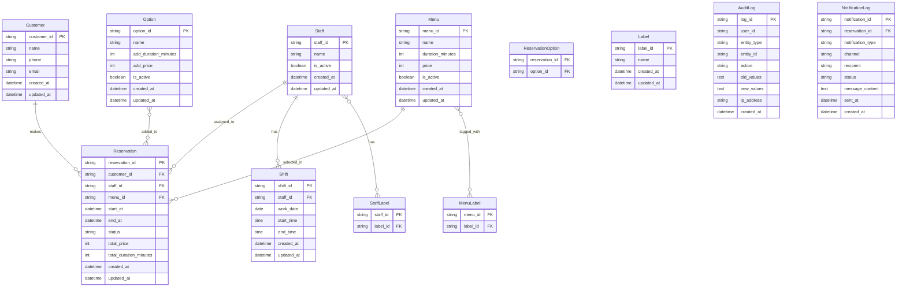

# 美容室予約管理アプリ データモデル定義書

## 1. 概要

本ドキュメントは美容室予約管理アプリMVPのデータモデル設計を定義する。
REQUIREMENTS.mdの要件を基に、予約管理に特化したシンプルで効率的なデータ構造を設計している。

## 2. ER図

## 3. エンティティ詳細定義

### 3.1 Customer（顧客）

| 列名 | データ型 | 必須 | 説明 |
|------|----------|------|------|
| customer_id | VARCHAR(36) | ✓ | 顧客ID（UUID） |
| name | VARCHAR(100) | ✓ | 顧客名 |
| phone | VARCHAR(20) | ✓ | 電話番号 |
| email | VARCHAR(255) | ✓ | メールアドレス |
| created_at | TIMESTAMP | ✓ | 作成日時 |
| updated_at | TIMESTAMP | ✓ | 更新日時 |

**制約・インデックス:**
- PRIMARY KEY: customer_id
- UNIQUE: phone
- UNIQUE: email
- INDEX: (phone), (email)

### 3.2 Staff（スタッフ）

| 列名 | データ型 | 必須 | 説明 |
|------|----------|------|------|
| staff_id | VARCHAR(36) | ✓ | スタッフID（UUID） |
| name | VARCHAR(100) | ✓ | スタッフ名 |
| is_active | BOOLEAN | ✓ | 有効フラグ |
| created_at | TIMESTAMP | ✓ | 作成日時 |
| updated_at | TIMESTAMP | ✓ | 更新日時 |

**制約・インデックス:**
- PRIMARY KEY: staff_id
- INDEX: (is_active)

### 3.3 Menu（メニュー）

| 列名 | データ型 | 必須 | 説明 |
|------|----------|------|------|
| menu_id | VARCHAR(36) | ✓ | メニューID（UUID） |
| name | VARCHAR(200) | ✓ | メニュー名 |
| duration_minutes | INT | ✓ | 所要時間（分） |
| price | INT | ✓ | 価格（円） |
| is_active | BOOLEAN | ✓ | 有効フラグ |
| created_at | TIMESTAMP | ✓ | 作成日時 |
| updated_at | TIMESTAMP | ✓ | 更新日時 |

**制約・インデックス:**
- PRIMARY KEY: menu_id
- INDEX: (is_active)
- CHECK: duration_minutes > 0
- CHECK: price >= 0

### 3.4 Option（オプション）

| 列名 | データ型 | 必須 | 説明 |
|------|----------|------|------|
| option_id | VARCHAR(36) | ✓ | オプションID（UUID） |
| name | VARCHAR(200) | ✓ | オプション名 |
| add_duration_minutes | INT | ✓ | 追加所要時間（分） |
| add_price | INT | ✓ | 追加価格（円） |
| is_active | BOOLEAN | ✓ | 有効フラグ |
| created_at | TIMESTAMP | ✓ | 作成日時 |
| updated_at | TIMESTAMP | ✓ | 更新日時 |

**制約・インデックス:**
- PRIMARY KEY: option_id
- INDEX: (is_active)
- CHECK: add_duration_minutes >= 0
- CHECK: add_price >= 0

### 3.5 Reservation（予約）

| 列名 | データ型 | 必須 | 説明 |
|------|----------|------|------|
| reservation_id | VARCHAR(36) | ✓ | 予約ID（UUID） |
| customer_id | VARCHAR(36) | ✓ | 顧客ID |
| staff_id | VARCHAR(36) | ✓ | スタッフID |
| menu_id | VARCHAR(36) | ✓ | メニューID |
| start_at | TIMESTAMP | ✓ | 開始日時 |
| end_at | TIMESTAMP | ✓ | 終了日時 |
| status | VARCHAR(20) | ✓ | ステータス |
| total_price | INT | ✓ | 合計金額 |
| total_duration_minutes | INT | ✓ | 合計所要時間 |
| created_at | TIMESTAMP | ✓ | 作成日時 |
| updated_at | TIMESTAMP | ✓ | 更新日時 |

**制約・インデックス:**
- PRIMARY KEY: reservation_id
- FOREIGN KEY: customer_id → Customer.customer_id
- FOREIGN KEY: staff_id → Staff.staff_id
- FOREIGN KEY: menu_id → Menu.menu_id
- INDEX: (staff_id, start_at), (customer_id), (status), (start_at)
- CHECK: end_at > start_at
- CHECK: status IN ('pending', 'confirmed', 'in_progress', 'completed', 'cancelled')

### 3.6 ReservationOption（予約オプション関連）

| 列名 | データ型 | 必須 | 説明 |
|------|----------|------|------|
| reservation_id | VARCHAR(36) | ✓ | 予約ID |
| option_id | VARCHAR(36) | ✓ | オプションID |

**制約・インデックス:**
- PRIMARY KEY: (reservation_id, option_id)
- FOREIGN KEY: reservation_id → Reservation.reservation_id
- FOREIGN KEY: option_id → Option.option_id

### 3.7 Shift（シフト）

| 列名 | データ型 | 必須 | 説明 |
|------|----------|------|------|
| shift_id | VARCHAR(36) | ✓ | シフトID（UUID） |
| staff_id | VARCHAR(36) | ✓ | スタッフID |
| work_date | DATE | ✓ | 勤務日 |
| start_time | TIME | ✓ | 開始時間 |
| end_time | TIME | ✓ | 終了時間 |
| created_at | TIMESTAMP | ✓ | 作成日時 |
| updated_at | TIMESTAMP | ✓ | 更新日時 |

**制約・インデックス:**
- PRIMARY KEY: shift_id
- FOREIGN KEY: staff_id → Staff.staff_id
- UNIQUE: (staff_id, work_date)
- INDEX: (staff_id, work_date), (work_date)
- CHECK: end_time > start_time

### 3.8 Label（ラベル）

| 列名 | データ型 | 必須 | 説明 |
|------|----------|------|------|
| label_id | VARCHAR(36) | ✓ | ラベルID（UUID） |
| name | VARCHAR(100) | ✓ | ラベル名 |
| created_at | TIMESTAMP | ✓ | 作成日時 |
| updated_at | TIMESTAMP | ✓ | 更新日時 |

**制約・インデックス:**
- PRIMARY KEY: label_id
- UNIQUE: name

### 3.9 StaffLabel（スタッフラベル関連）

| 列名 | データ型 | 必須 | 説明 |
|------|----------|------|------|
| staff_id | VARCHAR(36) | ✓ | スタッフID |
| label_id | VARCHAR(36) | ✓ | ラベルID |

**制約・インデックス:**
- PRIMARY KEY: (staff_id, label_id)
- FOREIGN KEY: staff_id → Staff.staff_id
- FOREIGN KEY: label_id → Label.label_id

### 3.10 MenuLabel（メニューラベル関連）

| 列名 | データ型 | 必須 | 説明 |
|------|----------|------|------|
| menu_id | VARCHAR(36) | ✓ | メニューID |
| label_id | VARCHAR(36) | ✓ | ラベルID |

**制約・インデックス:**
- PRIMARY KEY: (menu_id, label_id)
- FOREIGN KEY: menu_id → Menu.menu_id
- FOREIGN KEY: label_id → Label.label_id

### 3.11 AuditLog（監査ログ）

| 列名 | データ型 | 必須 | 説明 |
|------|----------|------|------|
| log_id | VARCHAR(36) | ✓ | ログID（UUID） |
| user_id | VARCHAR(36) |  | ユーザーID |
| entity_type | VARCHAR(50) | ✓ | エンティティ種別 |
| entity_id | VARCHAR(36) | ✓ | エンティティID |
| action | VARCHAR(20) | ✓ | アクション（CREATE/UPDATE/DELETE） |
| old_values | TEXT |  | 変更前の値（JSON） |
| new_values | TEXT |  | 変更後の値（JSON） |
| ip_address | VARCHAR(45) |  | IPアドレス |
| created_at | TIMESTAMP | ✓ | 作成日時 |

**制約・インデックス:**
- PRIMARY KEY: log_id
- INDEX: (entity_type, entity_id), (created_at), (user_id)
- CHECK: action IN ('CREATE', 'UPDATE', 'DELETE')

### 3.12 NotificationLog（通知ログ）

| 列名 | データ型 | 必須 | 説明 |
|------|----------|------|------|
| notification_id | VARCHAR(36) | ✓ | 通知ID（UUID） |
| reservation_id | VARCHAR(36) |  | 予約ID |
| notification_type | VARCHAR(50) | ✓ | 通知種別 |
| channel | VARCHAR(20) | ✓ | 通知チャネル |
| recipient | VARCHAR(255) | ✓ | 受信者 |
| status | VARCHAR(20) | ✓ | 送信ステータス |
| message_content | TEXT |  | メッセージ内容 |
| sent_at | TIMESTAMP |  | 送信日時 |
| created_at | TIMESTAMP | ✓ | 作成日時 |

**制約・インデックス:**
- PRIMARY KEY: notification_id
- FOREIGN KEY: reservation_id → Reservation.reservation_id
- INDEX: (reservation_id), (status), (sent_at)
- CHECK: channel IN ('email', 'sms', 'push')
- CHECK: status IN ('pending', 'sent', 'failed', 'delivered')

## 4. ビジネスルール

### 4.1 予約制約
- 予約は翌日から90日後までの範囲でのみ作成可能
- 同一スタッフの同一時間帯への重複予約は禁止
- スタッフの勤務時間外への予約は禁止
- メニューのラベルとスタッフの対応ラベルが一致しない場合の予約は禁止

### 4.2 データ保持ポリシー
- 監査ログは90日間保持
- 通知ログは30日間保持
- 完了・キャンセルされた予約データは2年間保持

### 4.3 暗号化対象
- 顧客の個人情報（name, phone, email）はat-rest暗号化が必要
- 通信は全てHTTPS/TLS 1.3以上で暗号化

## 5. パフォーマンス考慮事項

### 5.1 重要なクエリパターン
- スタッフ別・日付別の空き時間検索
- 顧客の予約履歴取得
- 予約ステータス別の予約一覧取得

### 5.2 インデックス戦略
- 複合インデックス: (staff_id, start_at) - 空き時間検索用
- 単一インデックス: customer_id, status, work_date等 - 各種絞り込み用

### 5.3 パーティショニング検討
- AuditLogテーブルは日付でパーティショニングを検討
- 大量データが予想される場合はReservationテーブルも月単位でパーティショニング

## 6. セキュリティ考慮事項

### 6.1 アクセス制御
- 顧客は自分の予約情報のみアクセス可能
- スタッフは担当予約とシフト情報のみアクセス可能
- 管理者は全データにアクセス可能

### 6.2 データマスキング
- 開発・テスト環境では個人情報をマスキング
- ログ出力時は個人情報を除外またはマスキング

## 7. 変更履歴

| 版 | 日付 | 変更内容 | 作成者 |
|----|------|----------|--------|
| v1.0 | 2025-06-29 | 初版作成 | Claude |